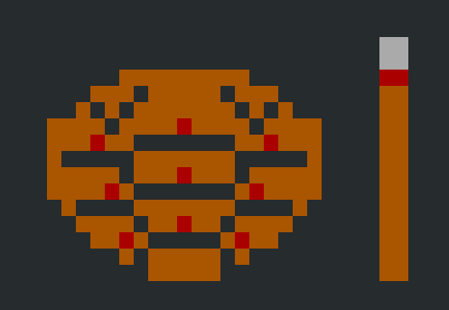

# tinbe



tinbe is static site generator.


## Usage

```
$ ./tinbe start

Some quiestions...

And then your project created.

project
|-- config.json
|-- docs/
     |-- index.html
     |-- style/
          |-- style.css
```

If you want to add new post, 

```
$ ./tinbe -a:hello

Or

$ ./tinbe --add:hello


project
|-- config.json
|-- docs/
     |-- index.html
     |-- hello.html   <==== New post is here.
     |-- style/
          |-- style.css

```

If you want to add new directory and new post,

```
$ ./tinbe -d:blog -a:index

project
|-- config.json
|-- docs/
     |-- index.html
     |-- blog/
           |-- index.html
     |--style/
        |-- style.css

```
Currently, if you create a new directory and create a new file,
you must modify the link to the CSS file yourself. Sorry.
